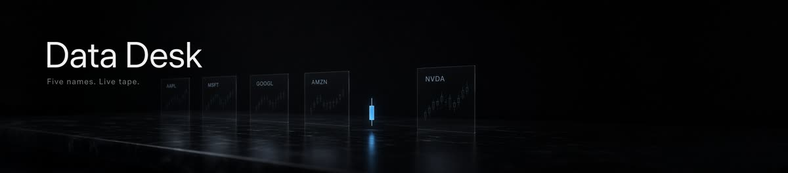
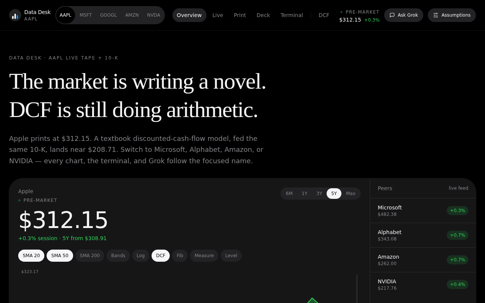
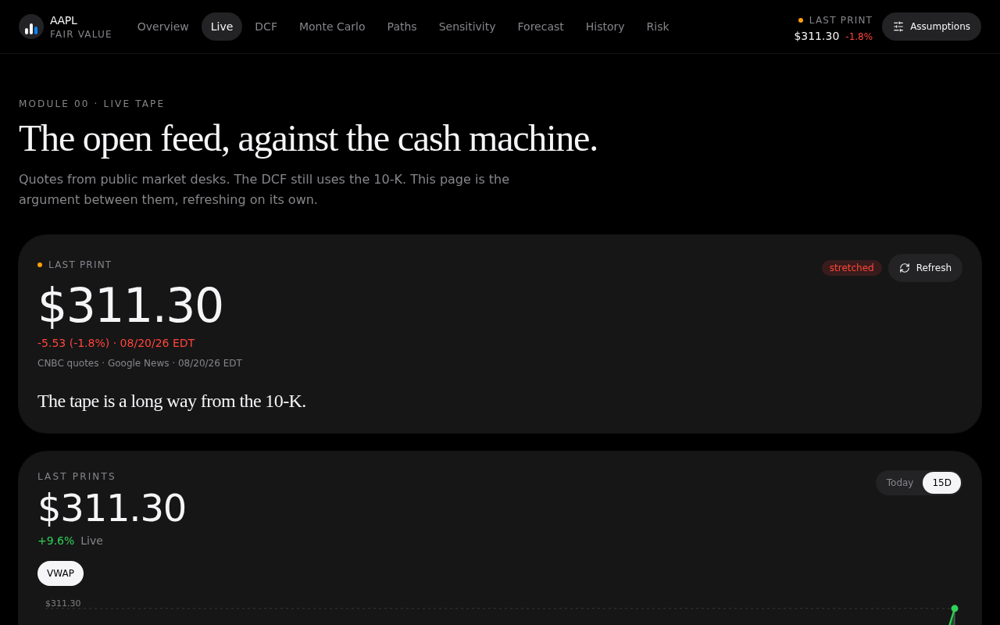
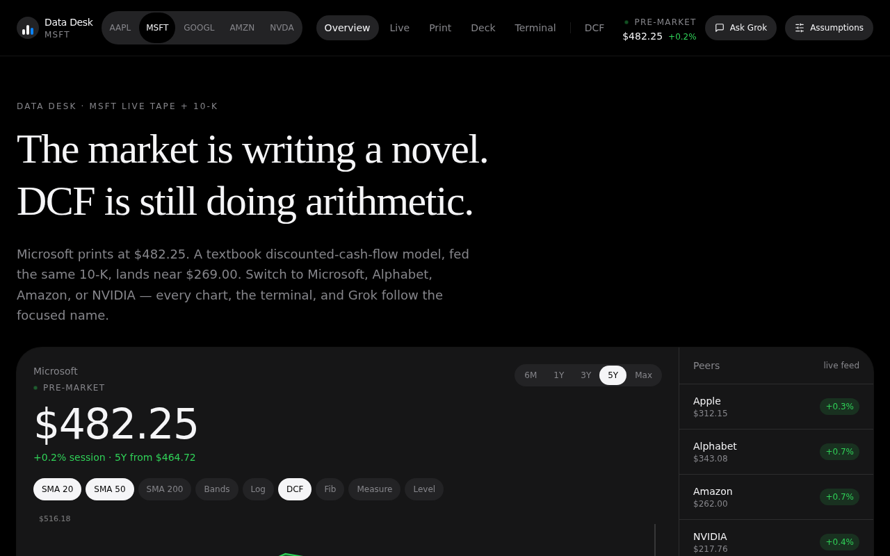
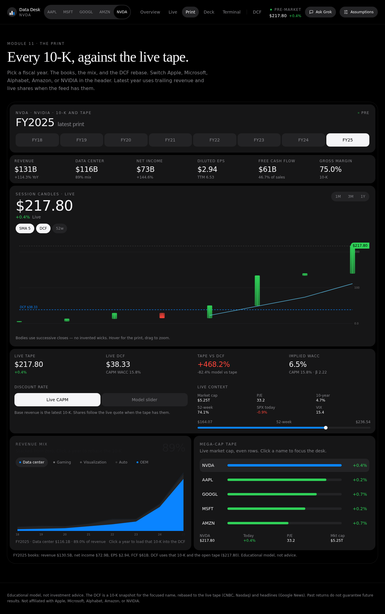
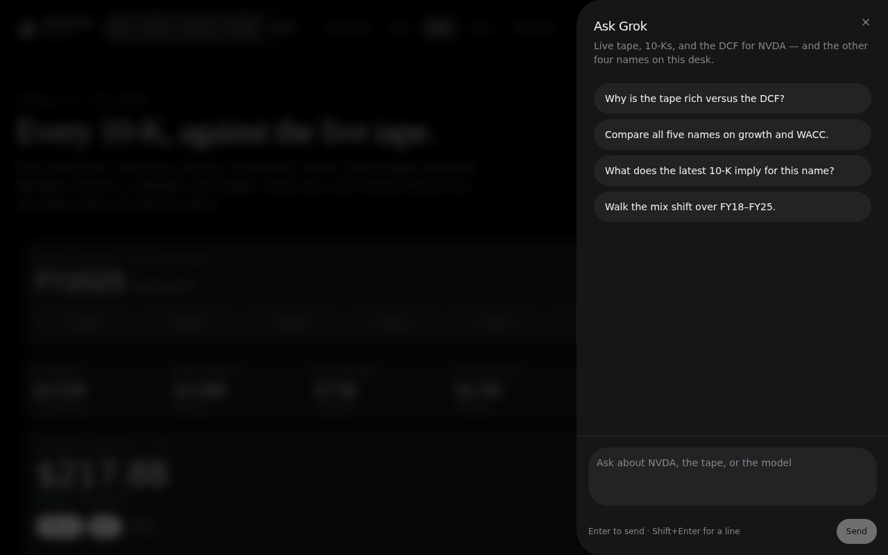
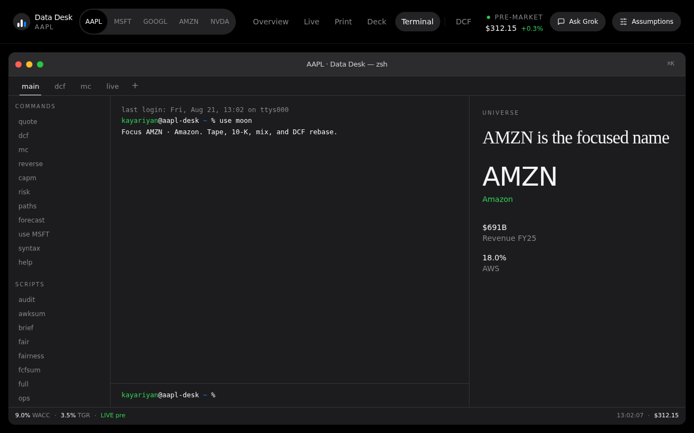
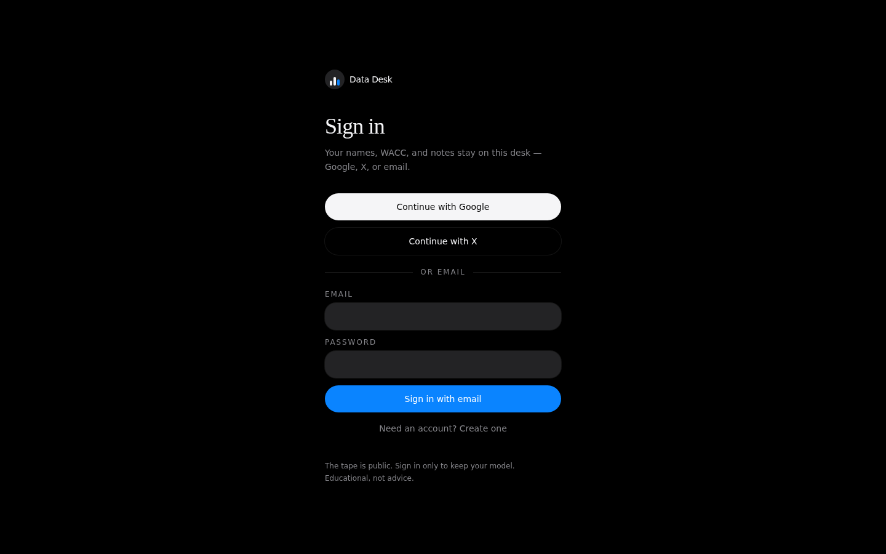
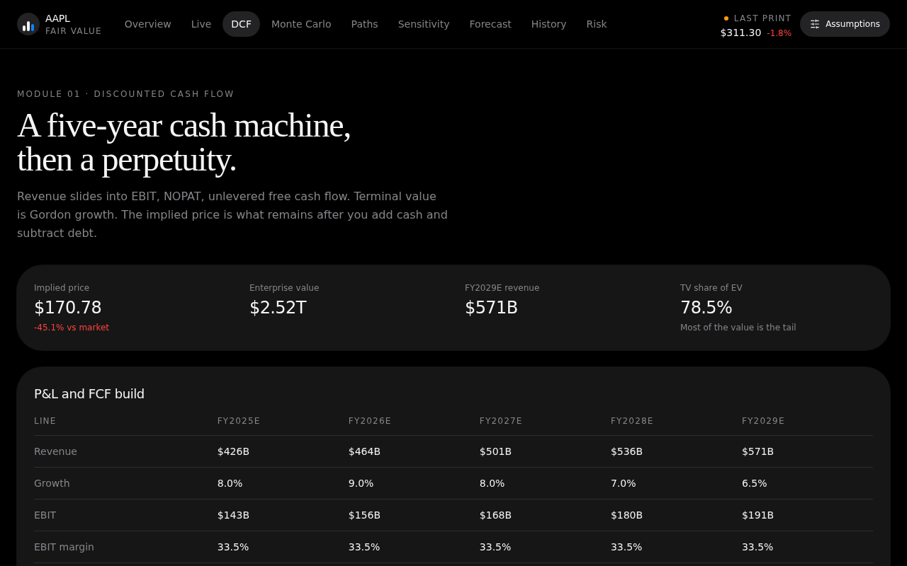
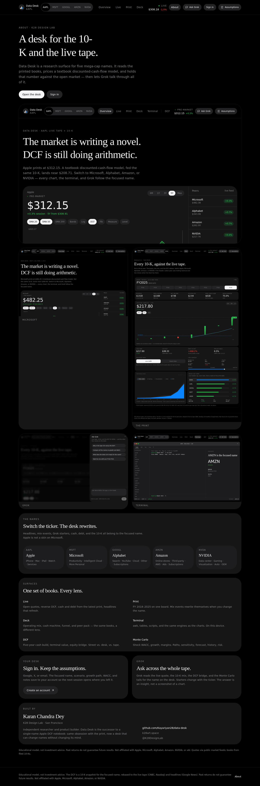

<p align="center">
  
</p>

<h1 align="center">Data Desk</h1>

<p align="center">
  <strong>Product design case</strong> · UI / UX predesign · K28 Design Lab<br>
  A research surface for Apple, Microsoft, Alphabet, Amazon, and NVIDIA.
</p>

<p align="center">
  <a href="#brief">Brief</a>
  ·
  <a href="#predesign-exploration">Predesign</a>
  ·
  <a href="#visual-language">Visual language</a>
  ·
  <a href="#surfaces">Surfaces</a>
  ·
  <a href="#about">Designer</a>
</p>

---

| | |
| --- | --- |
| **Role** | Product design, UI/UX, information architecture, visual language |
| **Designer** | [Karan Chandra Dey](https://github.com/Kayariyan28) · [K28 Design Lab](https://k28art.space) |
| **Type** | End-to-end product design, designed into a working desk |
| **Constraint** | One focused name. The whole surface rewrites. |
| **Names** | AAPL · MSFT · GOOGL · AMZN · NVDA |

This is not a dashboard reskin. It is a desk: the 10-K as a document, the tape as a live object, the DCF as arithmetic, and Grok as a colleague who has read all three.

<p align="center">
  
</p>

## Brief

Finance products split in two. Terminals are dense and hostile. Consumer apps are cheerful and thin. Neither feels like a place you sit with a name.

**Data Desk** was designed as that place. A single focused ticker. Filed books on the left of the mind, the open quote on the right, and a textbook discounted-cash-flow model holding the two together. Switching Apple to NVIDIA is not a theme change. It is a new desk.

The predecessor was a single-name Apple DCF notebook. Predesign asked: *what happens if the object is the name, not the model?*

## Predesign exploration

Before chrome, before charts, the work was structural.

**1. The object is the name.**  
A watchlist is a list. A desk is a surface for one company at a time. The primary control is a ticker strip, not a search box. Everything else — headline, mix events, cash, debt, Grok starters, the 10-K itself — belongs to that name.

**2. Copy is a design material.**  
Static labels (“Revenue mix, last eight years”) betray the product the moment you leave Apple. Each name has a voice: headlines, ledes, print titles, event callouts. Microsoft is Azure eating the stack. NVIDIA is gaming collapsing into data center. The UI was designed so the sentence changes before the candles do.

**3. The print is a document.**  
A 10-K is not a KPI row. Predesign treated FY 2018–2025 as a board you can page: year chips, mix as a stream, events as annotations on the year they happened. No pointer clutter. No fake navigation inside the chart.

**4. Color is reserved for the tape.**  
Up and down are the only moral colors. The rest of the product is black, hairline, and type. Accent blue is a system pointer (focus, sign-in), not a brand wash.

**5. Assumptions stay in reach.**  
WACC, growth, margins, terminal growth live in a single sheet. Every chart re-prices when a slider moves. The model is not a settings page; it is part of the desk.

**6. Terminal is a surface, not a developer easter egg.**  
If the engines are honest, they should be callable. The terminal was designed as a first-class module — same type, same names, same books — not a debug console bolted on.

These six decisions were locked before the first production layout. The screens below are the exploration made visible.

## Principles

1. **One name.** Never two. Switching is a rewrite, not a filter.
2. **Type does hierarchy.** Serif for the argument, sans for the instrument, mono for the tape and the term.
3. **Hairlines, not shadows.** Elevation is a 8% white stroke. Cards sit on black.
4. **Charts are instruments.** d3 candlesticks, streamgraphs, and waterfalls. No decorative gradients, no gauge ornaments.
5. **Quiet motion.** 150ms, ease-out, opacity and color. Nothing that fights a number.
6. **Sign-in is a door, not a wall.** The tape is public. The desk (name, scenario, notes) is yours.

## Visual language

A night desk. Editorial, not neon. Closer to a printed 10-K on a black table than to a trading toy.

| Token | Value | Role |
| --- | --- | --- |
| Canvas | `#000000` | Stage |
| Ink | `#f5f5f7` | Primary type |
| Quiet | `#86868b` | Kickers, ledes, axis copy |
| Hairline | `white / 8%` | Card edge |
| Accent | `#0a84ff` | Focus, primary pointer |
| Up / down | `#30d158` / `#ff453a` | Tape only |
| Display | **Newsreader** | Headlines, print titles |
| UI | **Outfit** | Nav, numbers, controls |
| Mono | SF Mono / ui-monospace | Tape, terminal |
| Radius | 8 / 12 / 18 | Pills, cards, sheets |
| Motion | 150ms · cubic-bezier(0.23, 1, 0.32, 1) | Hover, press, enter |

Kickers are uppercase, tracked, and small. Titles are serif and large enough to be the argument. Body is 1.5 leading, muted, and never wider than the thought.

Nav is a row of pills. The ticker strip is a segmented control with 44px targets. Sign-in is a centered column, one card, no illustration.

## Information architecture

```
Overview     — argument, tape, mix, distribution
Live         — quote, reverse DCF, cash machine, headlines
Print        — FY board, mix events, year chips
Deck         — operating mix, funnel, peer pack
Terminal     — the same engines, callable
────────────
DCF · Monte Carlo · Paths · Sensitivity · Forecast · History · Risk
────────────
About        — product, design, designer
Sign in      — Google, X, email · per-user desk
```

The header holds identity, name, primary surfaces, then models. About sits with the person, not in the product strip. On small screens the ticker is a second row; modules scroll as pills. Nothing wraps into a hamburger.

## Interaction design

**The name switch** is the product’s one gesture. It reloads books, rebases the DCF to the live quote, and rewrites every sentence on the desk. Predesign forbade a “skin”: Apple copy on an NVIDIA chart is a defect.

**The print** pages by fiscal year. Events sit on the year they belong to — Services crossing a quarter of Apple, Intelligent Cloud becoming half of Microsoft, data center swallowing NVIDIA. Pointers were tried and killed; the annotation is type, not a tooltip maze.

**Assumptions** open as a sheet from any module. Sliders are the control; the charts are the feedback. No apply button.

**Grok** is a sheet, not a chatbot page. Starters are written per name. It reads the quote, the 10-K, and the bridge that is already on screen.

**Sign-in** keeps the tape public. What persists is the focused name, scenario, growth path, WACC, and notes — the desk, not the market.

## Surfaces

Predesign to product. Each frame is a module, not a marketing mock.

| Live tape | Voice, rewritten |
| --- | --- |
|  |  |

| Print as a document | Grok on the desk |
| --- | --- |
|  |  |

| Terminal as a surface | Sign-in as a door |
| --- | --- |
|  |  |

<p align="center">
  
</p>

<p align="center">
  
</p>

## What shipped

- Five-name universe with a per-name voice, mix, and event set.
- Live tape against a reverse DCF; cash, debt, and shares from the print.
- Print board for FY 2018–2025.
- Operating deck, DCF, Monte Carlo, paths, sensitivity, forecast, history, risk.
- Terminal on the same books.
- Grok across quote, print, and model.
- Per-user desk: Google, X, or email.

## Stack

Designed in the product. React 19 · TanStack Start · Tailwind v4 · d3 · Zustand · Better Auth.

```bash
git clone https://github.com/Kayariyan28/data-desk.git
cd data-desk
npm install
npm run dev
```

## About

**Karan Chandra Dey** — product designer and builder at [K28 Design Lab](https://k28art.space). Independent researcher. This desk is the design exploration: a 10-K you can sit with, a tape you can distrust, and a model that does not pretend to be a story.

- GitHub: [Kayariyan28](https://github.com/Kayariyan28)
- X: [K28DesignLab](https://x.com/K28DesignLab)

Educational model, not investment advice. Not affiliated with Apple, Microsoft, Alphabet, Amazon, NVIDIA, or xAI.

## License

MIT. See [LICENSE](LICENSE).
